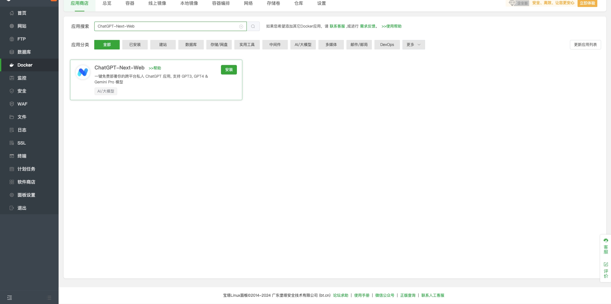
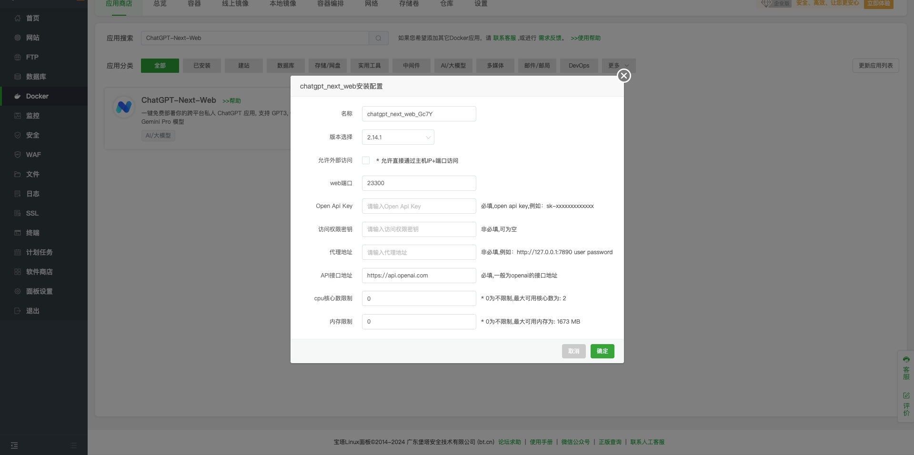
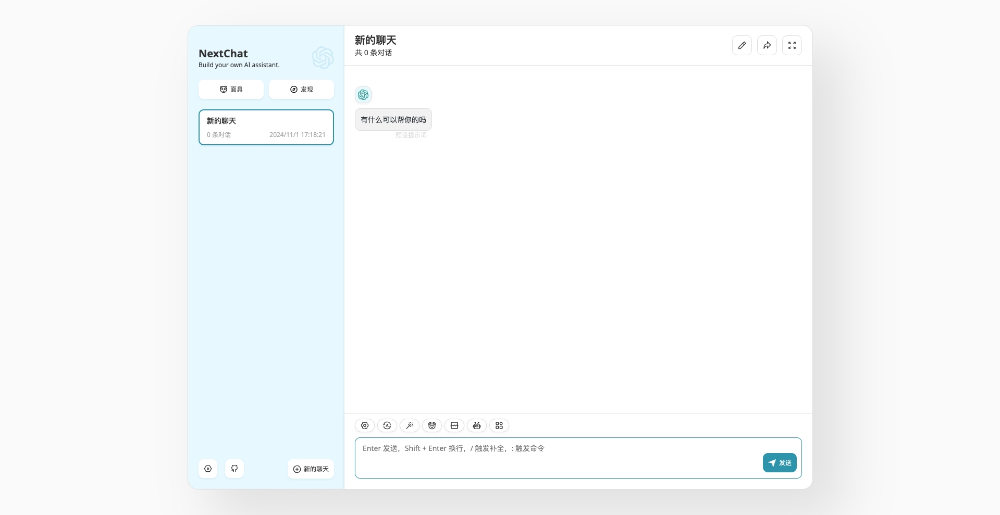
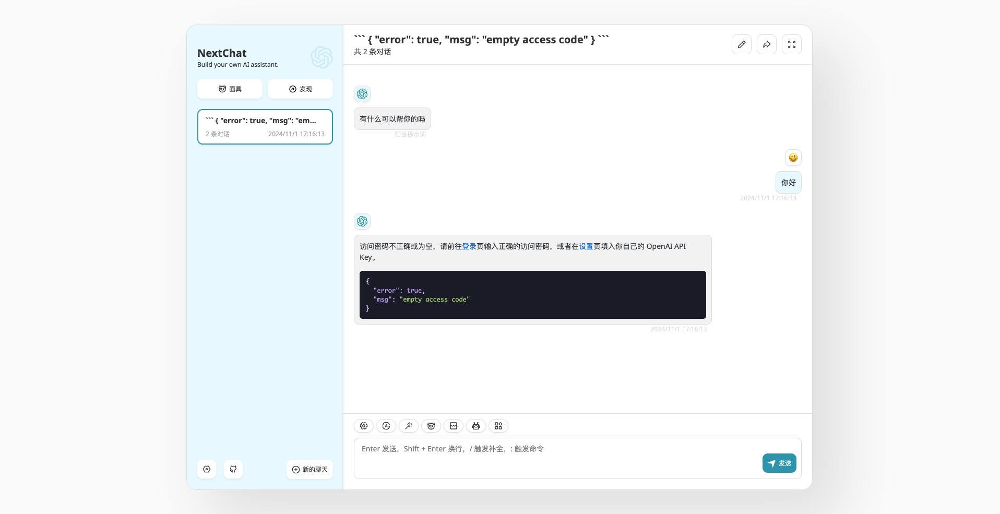
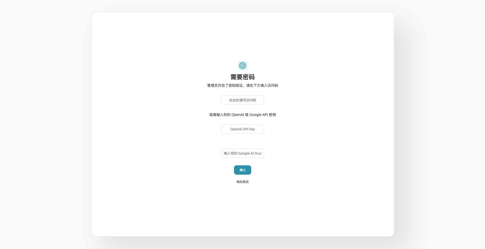
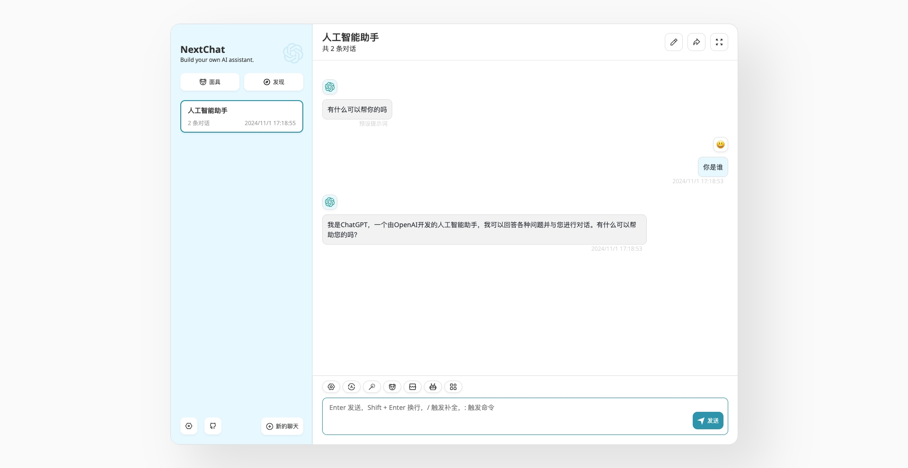

# Baota Panel Deployment Guide

## Prerequisites

Before deploying this project through Baota Panel, you need to first install the Baota Panel tool on your server. The following deployment process is based on the premise that Baota Panel is already installed. For Baota installation, please refer to ([Baota Official Website](https://www.bt.cn/new/download.html))

> Note: This project requires Baota Panel version 9.2.0 or higher

## One-Click Installation

1. In Baota Panel -> Docker -> App Store page, search for ChatGPT-Next-Web to find this project's docker application;
2. Click Install to start deploying this project

1. In the project configuration page, configure environment variables according to requirements;
2. If you check the "Allow External Access" configuration, please note to open the security group port access permissions for the configured web port;
3. Please ensure you have added the correct Open API Key, otherwise it cannot be used; when configuring the key provided by OpenAI official (inaccessible in China), please configure the proxy address;
4. It is recommended to configure the access permission password, otherwise everyone can use the configured Open API Key after deployment (when external access is allowed);
5. Click Confirm to start automatic deployment.

## How to Access

Access ChatGPT-Next-Web in your browser through the server IP address and configured web port: http://$(host):$(port)

If you have configured an access permission password, you need to log in before accessing the large model. Please click Login to obtain access permissions.

