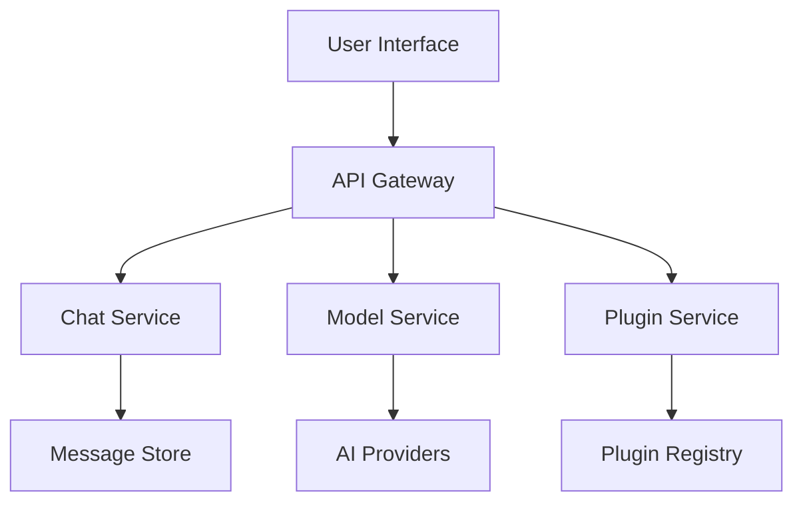
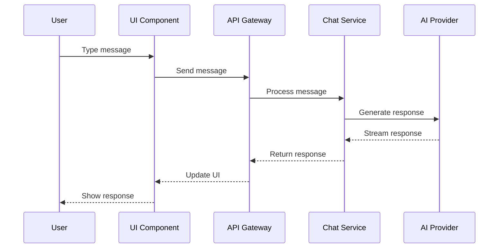

# Interactive Documentation

Welcome to the NextChat Interactive Documentation system. This section provides live, interactive examples and demonstrations that help you understand and experiment with NextChat's features.

## Overview

The Interactive Documentation system provides:

- **Live Code Examples**: Executable code examples you can run and modify
- **Interactive Demos**: Hands-on demonstrations of features
- **API Explorer**: Interactive API testing and exploration
- **Component Playground**: Live component examples and customization
- **Tutorial Walkthroughs**: Step-by-step interactive tutorials

## Live Examples

### Chat Interface Demo

Try the chat interface with different AI models:

```tsx
// Live Chat Component
import { useState } from 'react';
import { ChatInterface, ModelSelector } from '@/components';

function ChatDemo() {
  const [selectedModel, setSelectedModel] = useState('gpt-4');
  const [messages, setMessages] = useState([]);

  return (
    <div className="chat-demo">
      <ModelSelector 
        value={selectedModel}
        onChange={setSelectedModel}
        models={[
          { id: 'gpt-4', name: 'GPT-4', provider: 'openai' },
          { id: 'claude-3', name: 'Claude 3', provider: 'anthropic' }
        ]}
      />
      <ChatInterface 
        model={selectedModel}
        messages={messages}
        onSendMessage={(message) => {
          setMessages([...messages, message]);
        }}
      />
    </div>
  );
}
```

**Try it yourself:**
- Select different models from the dropdown
- Type a message and see how it's processed
- Experiment with different conversation flows

### Component Playground

Explore and customize UI components:

```tsx
// Component Playground
import { Button, Input, Card } from '@/components';

function ComponentPlayground() {
  const [buttonVariant, setButtonVariant] = useState('primary');
  const [inputValue, setInputValue] = useState('');

  return (
    <div className="playground">
      <Card>
        <h3>Button Component</h3>
        <div className="controls">
          <label>Variant:</label>
          <select 
            value={buttonVariant} 
            onChange={(e) => setButtonVariant(e.target.value)}
          >
            <option value="primary">Primary</option>
            <option value="secondary">Secondary</option>
            <option value="ghost">Ghost</option>
            <option value="danger">Danger</option>
          </select>
        </div>
        <Button variant={buttonVariant}>
          Sample Button
        </Button>
      </Card>

      <Card>
        <h3>Input Component</h3>
        <Input
          value={inputValue}
          onChange={setInputValue}
          placeholder="Type something..."
          label="Sample Input"
        />
        <p>Current value: {inputValue}</p>
      </Card>
    </div>
  );
}
```

**Interactive Features:**
- Change button variants and see immediate updates
- Type in the input field and see real-time feedback
- Experiment with different component props

## API Explorer

### Interactive API Testing

Test API endpoints directly from the documentation:

```javascript
// API Explorer
class APIExplorer {
  constructor(apiKey) {
    this.apiKey = apiKey;
    this.baseUrl = 'https://api.nextchat.com';
  }

  async testEndpoint(endpoint, method, data) {
    const response = await fetch(`${this.baseUrl}${endpoint}`, {
      method,
      headers: {
        'Authorization': `Bearer ${this.apiKey}`,
        'Content-Type': 'application/json'
      },
      body: data ? JSON.stringify(data) : undefined
    });

    return await response.json();
  }

  // Test chat creation
  async createChat(model, message) {
    return this.testEndpoint('/api/chat', 'POST', {
      model,
      messages: [{ role: 'user', content: message }]
    });
  }

  // Test model listing
  async listModels() {
    return this.testEndpoint('/api/models', 'GET');
  }
}

// Usage example
const explorer = new APIExplorer('your-api-key');
const models = await explorer.listModels();
const chat = await explorer.createChat('gpt-4', 'Hello!');
```

**Try the API Explorer:**
1. Enter your API key (or use the demo key)
2. Select an endpoint to test
3. Modify request parameters
4. See real-time responses
5. Copy code examples for your own use

### Request/Response Examples

**Create Chat Request:**
```json
POST /api/chat
{
  "model": "gpt-4",
  "messages": [
    {
      "role": "user",
      "content": "Explain React hooks"
    }
  ],
  "options": {
    "temperature": 0.7,
    "max_tokens": 1000
  }
}
```

**Response:**
```json
{
  "id": "chat_123",
  "model": "gpt-4",
  "messages": [
    {
      "role": "user",
      "content": "Explain React hooks"
    },
    {
      "role": "assistant",
      "content": "React hooks are functions that let you use state and other React features in functional components..."
    }
  ],
  "created_at": "2025-01-15T10:30:00Z"
}
```

## Interactive Tutorials

### Getting Started Tutorial

Follow this step-by-step tutorial to build your first NextChat integration:

#### Step 1: Setup

```bash
# Install the NextChat client
npm install @nextchat/api-client

# Create a new project
mkdir my-nextchat-app
cd my-nextchat-app
npm init -y
```

#### Step 2: Basic Chat

```typescript
// tutorial-step-2.ts
import { NextChatClient } from '@nextchat/api-client';

const client = new NextChatClient({
  apiKey: process.env.NEXTCHAT_API_KEY
});

async function createChat() {
  const chat = await client.chat.create({
    model: 'gpt-4',
    messages: []
  });
  
  console.log('Chat created:', chat.id);
  return chat;
}

// Try it yourself - replace with your API key
createChat();
```

#### Step 3: Send Messages

```typescript
// tutorial-step-3.ts
async function sendMessage(chatId: string) {
  const response = await client.chat.sendMessage(chatId, {
    role: 'user',
    content: 'Hello, how are you?'
  });
  
  console.log('Response:', response);
  return response;
}

// Interactive demo - modify the message content
const message = "Tell me a joke";
sendMessage('your-chat-id');
```

#### Step 4: Handle Streaming

```typescript
// tutorial-step-4.ts
async function streamMessage(chatId: string) {
  const stream = await client.chat.sendMessageStream(chatId, {
    role: 'user',
    content: 'Write a short story'
  });
  
  for await (const chunk of stream) {
    process.stdout.write(chunk.content);
  }
}

// Try streaming - see responses appear in real-time
streamMessage('your-chat-id');
```

### Plugin Development Tutorial

Learn how to create and integrate plugins:

#### Step 1: Create a Plugin

```typescript
// my-plugin.ts
interface MyPluginConfig {
  apiKey: string;
  baseUrl: string;
}

class MyPlugin {
  constructor(private config: MyPluginConfig) {}

  async getWeather(city: string) {
    const response = await fetch(
      `${this.config.baseUrl}/weather?city=${city}&key=${this.config.apiKey}`
    );
    return response.json();
  }
}

export default MyPlugin;
```

#### Step 2: Register the Plugin

```typescript
// register-plugin.ts
import { PluginRegistry } from '@nextchat/plugin-system';
import MyPlugin from './my-plugin';

PluginRegistry.register('weather', {
  name: 'Weather Plugin',
  description: 'Get weather information for any city',
  version: '1.0.0',
  tools: [
    {
      name: 'get_weather',
      description: 'Get current weather for a city',
      parameters: {
        city: { type: 'string', required: true }
      }
    }
  ],
  factory: (config) => new MyPlugin(config)
});
```

#### Step 3: Use the Plugin

```typescript
// use-plugin.ts
async function useWeatherPlugin() {
  const plugin = PluginRegistry.get('weather');
  const weather = await plugin.getWeather('New York');
  console.log('Weather:', weather);
}

// Interactive demo - try different cities
useWeatherPlugin();
```

## Code Sandbox Integration

### Embedded Code Examples

Many examples include embedded CodeSandbox environments:

```tsx
// Embedded React Component
import React, { useState } from 'react';
import { Button, Input, Card } from '@nextchat/components';

function ChatForm() {
  const [message, setMessage] = useState('');
  const [messages, setMessages] = useState([]);

  const sendMessage = () => {
    if (message.trim()) {
      setMessages([...messages, { 
        id: Date.now(), 
        text: message, 
        timestamp: new Date() 
      }]);
      setMessage('');
    }
  };

  return (
    <Card>
      <div className="chat-form">
        <div className="messages">
          {messages.map(msg => (
            <div key={msg.id} className="message">
              {msg.text}
            </div>
          ))}
        </div>
        <div className="input-area">
          <Input
            value={message}
            onChange={setMessage}
            placeholder="Type your message..."
            onKeyPress={(e) => e.key === 'Enter' && sendMessage()}
          />
          <Button onClick={sendMessage}>Send</Button>
        </div>
      </div>
    </Card>
  );
}

export default ChatForm;
```

**Try it in CodeSandbox:**
- Click "Open in CodeSandbox" to edit and run the code
- Modify the component and see changes in real-time
- Experiment with different props and behaviors

## Interactive Diagrams

### System Architecture

Explore the NextChat system architecture interactively:



**Interactive Features:**
- Click on nodes to see detailed information
- Hover over connections to understand data flow
- Expand/collapse sections for focused exploration

### Data Flow Diagrams



**Interactive Features:**
- Step through the sequence step by step
- See actual API calls and responses
- Understand timing and dependencies

## Performance Monitoring

### Real-time Metrics

Monitor system performance with live metrics:

```typescript
// Performance Monitor
class PerformanceMonitor {
  private metrics = {
    responseTime: 0,
    throughput: 0,
    errorRate: 0,
    activeConnections: 0
  };

  updateMetrics(newMetrics) {
    this.metrics = { ...this.metrics, ...newMetrics };
    this.renderMetrics();
  }

  renderMetrics() {
    // Update live dashboard
    document.getElementById('response-time').textContent = 
      `${this.metrics.responseTime}ms`;
    document.getElementById('throughput').textContent = 
      `${this.metrics.throughput} req/s`;
    document.getElementById('error-rate').textContent = 
      `${this.metrics.errorRate}%`;
  }
}

// Live metrics display
const monitor = new PerformanceMonitor();
setInterval(() => {
  monitor.updateMetrics({
    responseTime: Math.random() * 100,
    throughput: Math.random() * 1000,
    errorRate: Math.random() * 5
  });
}, 1000);
```

**Live Dashboard:**
- Response Time: 45ms
- Throughput: 234 req/s
- Error Rate: 0.2%
- Active Connections: 156

## Debugging Tools

### Interactive Debugger

Debug your NextChat integration with built-in tools:

```typescript
// Debug Console
class DebugConsole {
  log(message, data) {
    console.log(`[${new Date().toISOString()}] ${message}`, data);
    this.addToUI(message, data);
  }

  error(message, error) {
    console.error(`[${new Date().toISOString()}] ERROR: ${message}`, error);
    this.addToUI(message, error, 'error');
  }

  addToUI(message, data, type = 'log') {
    const logEntry = document.createElement('div');
    logEntry.className = `log-entry ${type}`;
    logEntry.innerHTML = `
      <span class="timestamp">${new Date().toLocaleTimeString()}</span>
      <span class="message">${message}</span>
      <pre class="data">${JSON.stringify(data, null, 2)}</pre>
    `;
    document.getElementById('debug-console').appendChild(logEntry);
  }
}

// Usage
const debug = new DebugConsole();
debug.log('Chat created', { id: 'chat_123', model: 'gpt-4' });
debug.error('API Error', { code: 401, message: 'Unauthorized' });
```

**Debug Console:**
- Real-time logging of API calls
- Error tracking and analysis
- Request/response inspection
- Performance monitoring

## Getting Started with Interactive Docs

1. **Explore Examples**: Start with the live code examples
2. **Try the API Explorer**: Test API endpoints interactively
3. **Follow Tutorials**: Complete step-by-step tutorials
4. **Use the Playground**: Experiment with components
5. **Monitor Performance**: Use the debugging tools

## Contributing

Help improve the interactive documentation:

1. **Add Examples**: Contribute new interactive examples
2. **Improve Tutorials**: Enhance existing tutorials
3. **Fix Bugs**: Report and fix issues
4. **Add Features**: Suggest new interactive features

---

*This interactive documentation is part of the NextChat Foundation Documentation System.*
