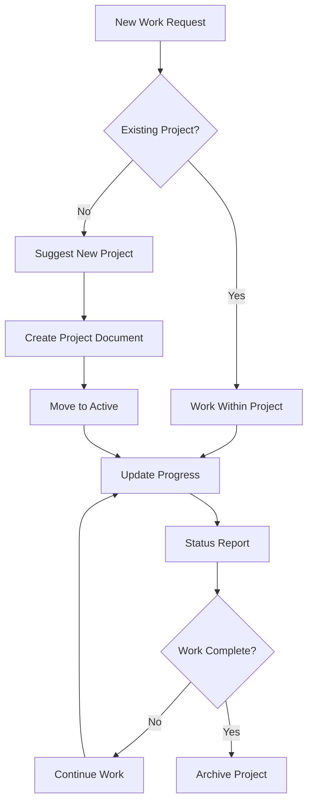

# Project Management System Guide

## Overview

This guide explains how to use the document-driven project management system for coordinating development work with AI coding agents. The system ensures strategic oversight while providing clear execution guidance through structured documentation.

## System Architecture

## Quick Start

1. **Check for existing projects** - AI agents automatically check `/docs/projects/active/` and `/docs/projects/ideas/`
2. **Start new project** - Use `project new` prompt or let AI suggest when appropriate
3. **Work within project context** - All development work happens within project documents
4. **Track progress** - AI agents update project documents automatically
5. **Complete and archive** - Use `project complete` when work is finished

## Key Components

### Project Documents
- **Location**: `/docs/projects/`
- **Structure**: Template-based with metadata, context, and progress tracking
- **Lifecycle**: idea → plan → design → implementation → testing → review → deployment → completion

### AI Agent Integration
- **Automatic suggestions** for new projects
- **Status reports** after every code change
- **Progress tracking** in project documents
- **Handoff protocols** for context switching

### Quick Prompts
- **2-3 word triggers** for common operations
- **Namespaced** for future extensibility
- **Comprehensive coverage** of project lifecycle

## Navigation

- [Getting Started](/docs/getting-started.md) - Quick setup and first project
- [Agent Interaction](/docs/agent-interaction.md) - Working with AI agents
- [Workflows](/docs/workflows.md) - Common development patterns
- [Prompts](/docs/prompts.md) - Complete prompt reference
- [Troubleshooting](/docs/troubleshooting.md) - Common issues and solutions
- [Visual Guide](/docs/visual-guide.md) - Diagrams and flowcharts

## Benefits

- **Strategic oversight** - Human maintains control of project direction
- **Clear execution** - AI agents have detailed context and requirements
- **Progress tracking** - Comprehensive documentation of all work
- **Context preservation** - Knowledge maintained across agent handoffs
- **Quality assurance** - Structured validation and acceptance criteria

## Getting Help

- Use `guide show` prompt to display this index
- Use `project templates` to see available project types
- Use `project validate` to check document completeness
- Check [troubleshooting](/docs/troubleshooting.md) for common issues
