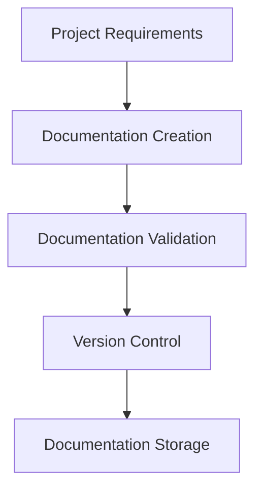
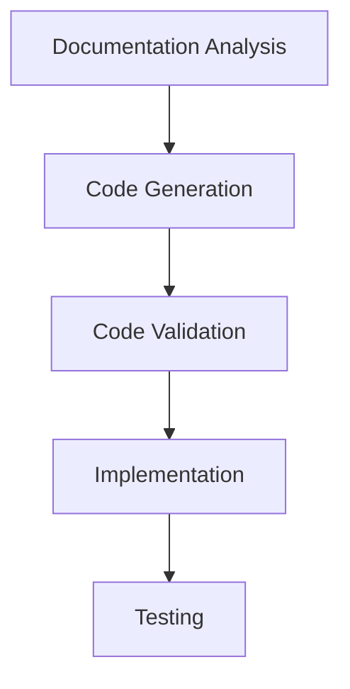
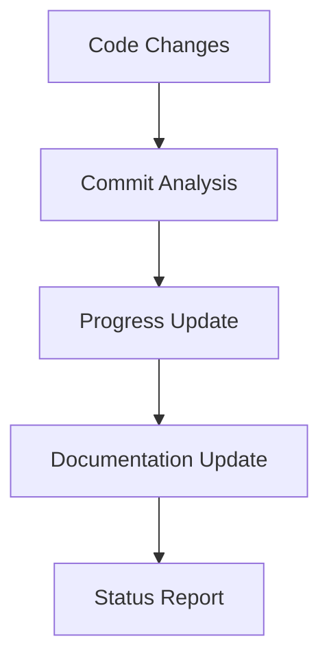

# Document-Driven Architecture Overview

## 🎯 What is Document-Driven Architecture?

Document-Driven Architecture (DDA) is a development methodology where documentation serves as the primary source of truth for system design, implementation, and maintenance. In this approach, code is generated, validated, and maintained based on comprehensive documentation that describes the system's behavior, structure, and requirements.

## 🏗️ Core Principles

### 1. Documentation as Source of Truth
- **Primary Authority**: Documentation is the authoritative source for all system decisions
- **Code Generation**: Code is generated from documentation specifications
- **Validation**: All implementations are validated against documentation
- **Synchronization**: Documentation and code must always be in sync

### 2. Automated Documentation Generation
- **Code Analysis**: Automatic extraction of documentation from code changes
- **Commit Integration**: Documentation updates based on commit messages and changes
- **Progress Tracking**: Automatic tracking of project progress from development activities
- **Status Reporting**: Real-time status reports generated from documentation

### 3. Version-Controlled Documentation
- **Semantic Versioning**: Documentation follows semantic versioning principles
- **Change Tracking**: All documentation changes are tracked and versioned
- **Migration Support**: Automated migration between documentation versions
- **Rollback Capability**: Ability to rollback to previous documentation versions

### 4. AI-Optimized Structure
- **Machine Readable**: Documentation structured for AI consumption
- **Consistent Format**: Standardized format across all documentation
- **Metadata Rich**: Comprehensive metadata for AI processing
- **Relationship Mapping**: Clear relationships between documentation components

## 🎯 Benefits for AI Development

### For AI Agents
- **Clear Context**: Comprehensive context for AI decision-making
- **Consistent Patterns**: Standardized patterns for AI implementation
- **Automated Validation**: Built-in validation for AI-generated code
- **Progress Tracking**: Clear visibility into project progress and status

### For AI Coders
- **Guided Development**: Clear guidance for implementation decisions
- **Quality Assurance**: Built-in quality checks and validation
- **Best Practices**: Embedded best practices and patterns
- **Error Prevention**: Proactive error prevention through documentation

### For AI Developers
- **Rapid Onboarding**: Quick understanding of system architecture
- **Consistent Implementation**: Standardized implementation approaches
- **Automated Testing**: Documentation-driven test generation
- **Performance Optimization**: Built-in performance guidelines

## 🏛️ Architecture Components

### 1. Documentation Layer
```
┌─────────────────────────────────────┐
│           Documentation Layer       │
├─────────────────────────────────────┤
│ • Project Documentation             │
│ • API Documentation                 │
│ • Component Documentation           │
│ • Architecture Documentation        │
│ • Best Practices Documentation      │
└─────────────────────────────────────┘
```

### 2. Processing Layer
```
┌─────────────────────────────────────┐
│           Processing Layer          │
├─────────────────────────────────────┤
│ • Document Analysis                 │
│ • Code Generation                   │
│ • Validation Engine                 │
│ • Progress Tracking                 │
│ • Status Reporting                  │
└─────────────────────────────────────┘
```

### 3. Integration Layer
```
┌─────────────────────────────────────┐
│           Integration Layer         │
├─────────────────────────────────────┤
│ • Git Integration                   │
│ • CI/CD Integration                 │
│ • Project Management Integration    │
│ • Monitoring Integration            │
│ • Notification Integration          │
└─────────────────────────────────────┘
```

### 4. Application Layer
```
┌─────────────────────────────────────┐
│           Application Layer         │
├─────────────────────────────────────┤
│ • NextChat Application              │
│ • AI Agent Framework                │
│ • Plugin System                     │
│ • Component Library                 │
│ • Testing Framework                 │
└─────────────────────────────────────┘
```

## 🔄 Workflow Process

### 1. Documentation Creation


### 2. Code Generation


### 3. Progress Tracking


## 📋 Documentation Types

### 1. Project Documentation
- **Project Overview**: High-level project description and goals
- **Requirements**: Detailed functional and non-functional requirements
- **Architecture**: System architecture and design decisions
- **Implementation Plan**: Step-by-step implementation roadmap
- **Testing Strategy**: Comprehensive testing approach
- **Deployment Guide**: Deployment and configuration instructions

### 2. API Documentation
- **Endpoint Specifications**: Detailed API endpoint documentation
- **Request/Response Schemas**: Complete data structure definitions
- **Authentication**: Security and authentication requirements
- **Error Handling**: Error codes and handling strategies
- **Rate Limiting**: Performance and rate limiting guidelines
- **Versioning**: API versioning and migration strategies

### 3. Component Documentation
- **Component Overview**: Component purpose and functionality
- **Props Interface**: Complete props and interface definitions
- **Usage Examples**: Practical usage examples and patterns
- **Styling Guide**: Styling and theming guidelines
- **Accessibility**: Accessibility features and compliance
- **Performance**: Performance considerations and optimizations

### 4. Architecture Documentation
- **System Overview**: High-level system architecture
- **Component Relationships**: Component interaction diagrams
- **Data Flow**: Data flow and processing pipelines
- **Security Model**: Security architecture and implementation
- **Scalability**: Scalability considerations and strategies
- **Monitoring**: Monitoring and observability setup

## 🛠️ Implementation Guidelines

### 1. Documentation Structure
```yaml
# Standard documentation structure
project:
  metadata:
    id: string
    title: string
    version: string
    stage: string
    priority: string
    tags: string[]
  
  context:
    problem: string
    solution: string
    benefits: string[]
    constraints: string[]
  
  requirements:
    functional: string[]
    non-functional: string[]
    technical: string[]
  
  implementation:
    phases: Phase[]
    tasks: Task[]
    deliverables: string[]
  
  success_criteria:
    quantitative: Metric[]
    qualitative: string[]
```

### 2. Code Generation Patterns
```typescript
// Example: Component generation from documentation
interface ComponentSpec {
  name: string;
  props: PropDefinition[];
  variants: VariantDefinition[];
  examples: ExampleDefinition[];
  tests: TestDefinition[];
}

// Generated component structure
const Component = ({ ...props }: ComponentProps) => {
  // Implementation based on documentation
};
```

### 3. Validation Rules
```yaml
# Validation rules for documentation
validation:
  structure:
    required_fields: string[]
    field_types: object
    relationships: object
  
  content:
    completeness: boolean
    accuracy: boolean
    consistency: boolean
  
  code:
    syntax: boolean
    types: boolean
    tests: boolean
```

## 📊 Metrics and Monitoring

### 1. Documentation Quality Metrics
- **Completeness**: Percentage of required documentation present
- **Accuracy**: Percentage of documentation matching implementation
- **Consistency**: Consistency across documentation sections
- **Timeliness**: Time between code changes and documentation updates

### 2. Code Quality Metrics
- **Coverage**: Test coverage based on documentation requirements
- **Compliance**: Adherence to documented standards and patterns
- **Performance**: Performance metrics compared to documented targets
- **Security**: Security compliance based on documented requirements

### 3. Process Metrics
- **Generation Time**: Time to generate code from documentation
- **Validation Time**: Time to validate implementation against documentation
- **Update Frequency**: Frequency of documentation updates
- **Sync Accuracy**: Accuracy of documentation-code synchronization

## 🎯 Best Practices

### 1. Documentation Writing
- **Be Specific**: Provide specific, actionable information
- **Use Examples**: Include practical examples and use cases
- **Maintain Consistency**: Follow consistent formatting and structure
- **Keep Updated**: Regularly update documentation with changes

### 2. Code Generation
- **Follow Patterns**: Use established patterns and templates
- **Validate Output**: Always validate generated code
- **Test Thoroughly**: Comprehensive testing of generated code
- **Monitor Performance**: Track performance of generated code

### 3. Process Management
- **Automate Everything**: Automate documentation and code generation
- **Version Control**: Use proper version control for all artifacts
- **Monitor Quality**: Continuously monitor documentation and code quality
- **Iterate Continuously**: Continuously improve processes and tools

## 🚀 Getting Started

### 1. Set Up Documentation Structure
```bash
# Create documentation directory structure
mkdir -p docs/ai-coder/architecture/overview
mkdir -p docs/ai-coder/best-practices
mkdir -p docs/ai-coder/examples
mkdir -p docs/ai-coder/debugging
mkdir -p docs/ai-coder/security
mkdir -p docs/ai-coder/learning
```

### 2. Create Initial Documentation
```bash
# Create initial project documentation
touch docs/ai-coder/architecture/overview/README.md
touch docs/ai-coder/best-practices/coding/README.md
touch docs/ai-coder/examples/code/README.md
```

### 3. Set Up Validation
```bash
# Set up documentation validation
npm install -g markdownlint
npm install -g yaml-lint
```

### 4. Configure Automation
```bash
# Set up automated documentation generation
npm install -g documentation
npm install -g jsdoc
```

## 📚 Related Documentation

- [Project Management System](./project-management/README.md)
- [Version Control Practices](./version-control/README.md)
- [Commit Integration](./commit-integration/README.md)
- [Plan Analysis Framework](./plan-analysis/README.md)
- [Quality Assurance](./quality-assurance/README.md)

## 🔗 External Resources

- [Document-Driven Development](https://en.wikipedia.org/wiki/Document-driven_development)
- [API-First Development](https://swagger.io/resources/articles/adopting-an-api-first-approach/)
- [Test-Driven Development](https://en.wikipedia.org/wiki/Test-driven_development)
- [Behavior-Driven Development](https://en.wikipedia.org/wiki/Behavior-driven_development)

---

*This documentation is part of the NextChat AI Coder Documentation system and follows document-driven architecture principles.*
